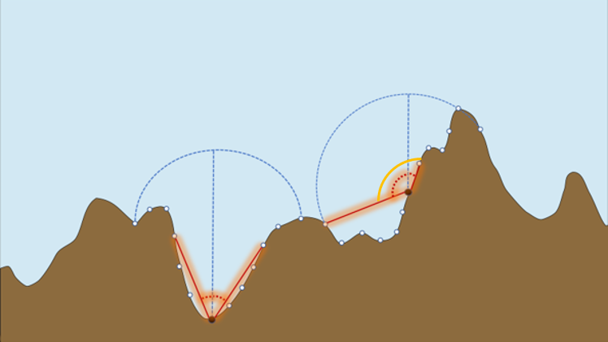

This script includes functions that calculate the Sky View Factor index (SkyView).
Sky view factor index is an established measure to estimate the degree to which topographic complexity blocks the sky, used mainly in the urban planning field. In the context of habitat complexity, if less of the surface is observed from a point, it is likely that this point is more concealed. Thus, the SkyView may be a proxy for available refuge space. We used the mean angle (SkyView) of the bottom profile to estimate the amount of refuge space and the standard deviation of the angles of the bottom profile (SkyView_sd) to estimate the heterogeneity of complexity-generating elements. As SkyView_sd increase the transect is more heterogenous, providing both exposed and sheltered habitat.

The concept is presented using a bottom profile illustration.

The angles calaulated are the angles between an axis perpendicular the sea surface and the subsequent/previous (right/left, respectively) measurements (AKA points). 

The first calculation step is done seperatly for angles to the **right** of each measurement and angles to the **left** of each measurement. 
For each direction:

1. The angles are calculated within a specified distance range - the arch's radius - blue dashed line. White points along the profile represent the measurements within the arch. 
2. The smallest angle within this range is extracted - red dashed lines. 

The second step involves joining of the smallest angles from both directions to form a complete angle between a measurement and an arch surounding it - yellow line. 

Then, the minimal angles for each measurement along the profile are summarized using their mean value (see details further on the code).




The script includes 6 functions, and a wrapper function (*wrap_fun*):

1. **arrange_data_fun** - defines needed variables 

2. **calc_right_angles_fun** - calculates the angles to the right of each measurement

3. **calc_left_angles_fun** - calculates the angles to the left of each measurement

4. **all_fun** - calculates the minimum angle from each measurement within a given distance

5. **summarizing_fun** - calculates the mean angle (SkyView) and angles standard deviation (SkyView_sd) per transect

6. **wrapper_fun** - combine all previous functions 

Functions 1-6 refer are built to run for one transect data. The 7th function - 'apply_svf_fun' apply these functions on the full data, creating an index value for each transect. 

7. **apply_svf_fun** - apply the wrapper function for each transect. The output is the indices values for all data.


Needed packages:

```r
library(dplyr)
library(tidyverse)
library(httr)
library(reshape2)
library(stringr)
library(data.table)
```


The necessary data for these functions should include 3 variables:

  * Depth values along the bottom profile
  * Their order, i.e. an acending sequence of numbers corresponding to the measurements
  * An identification variable distinct for each bottom profile

The names of the columns should be: 'ID', 'depth', 'point', they are later transformed.
An example:


**1. arrange_data_fun**


```r
arrange_data_fun = function (data) {
  
  if( any(is.na(data$depth)) ) stop('missing depth data') #Calculation isn't possible with missing 'depth' values
  if( any(is.na(data$point)) ) stop('missing measurements data') #Calculation isn't possible with missing 'points' values
  
  data = as.data.frame(data %>% mutate(y = depth * (-1), #'depth' variable is multiplied by -1 to create a realistic bottom profile 
  x = 1:length(depth)) %>% #'unit' variable - measurements in ascending order, per transect
  select(ID, x, y))
  
  return(data)
}
```

**2. calc_right_angles_fun** - calculates the angles to the *Right* of each measurement.
Results will show the angles between each point and **all** of its subsequent points.
Each row represents a point, and contains the sequence of all angles from this point to the last point in the transect.  


```r
calc_right_angles_fun = function(data, transect_length){
  
  #Calc. the distance between a pair of measurements within the transect
  distance = transect_length/(nrow(data)-1)
  
  #1. Use only measurements (point) and depths data
  right_data = data[2:3]
  
  #2. For each depth measurement, calc. the angles to its right using arctang, and store the results in subsequent columns
  for (j in 1:(nrow(right_data)-1)){
    right_data[,(2+j)] = ifelse(test=right_data$y>=lead(right_data$y,j),
                                yes = 90 
                                + atan( (abs(lead(right_data$y,j)-right_data$y)) / (distance * j) )*(180/pi),
                                no = 
                                  atan( (distance * j) / (abs(lead(right_data$y,j)-right_data$y)) )*(180/pi) )
  } 
  
  right_data = cbind.data.frame(ID = data$ID, right_data)
  
  return(right_data)
}
```

**3. calc_left_angles_fun** - calculates the angles to the *Left* of each measurement
Results for left angles will show the angles between each point and **all** of its previous points.
Each row represents a point, and contains the sequence of all angles from this point to the beggining of the transect.


```r
calc_left_angles_fun = function(data, transect_length){
  
  #Calc. the distance between a pair of measurements within the transect
  distance = transect_length/(nrow(data)-1)
  
  #1. Use only measurements (point) and depths data
  left_data = data[2:3]
  
  #2. For each depth measurement, calc. the angles to its left using arctang and store the results in subsequent columns
  for (j in 1:(nrow(left_data)-1)){
    left_data[,(2+j)] = ifelse(test=left_data$y >= lag(left_data$y,j),
                               yes = 90 + atan( (abs(lag(left_data$y,j)-left_data$y)) /      (distance*j)) * (180/pi),
                               no = 
                                 atan( (distance*j) / (abs(lag(left_data$y,j)-left_data$y)) ) * (180/pi)
    )
  }
  
  left_data = cbind.data.frame(ID = data$ID, left_data)
  
  return(left_data)
}
```

**4. all_fun** - calculates the minimum angle from each measurement within a given distance

Since we hypothesize that the topography will not be as complex as to impact the angle beyond a certain spatial range (for example, a very high point at a distance of 6 meters will not overshadow the reference point), we constrain the distance of the search of the minimum angle to 2.5 meters from each direction. 
Therfore, we only take the x first rows that constitute a 2.5 meters distance, from which we extract the minimum angle. 

Additionaly, the transects' ends (first and last 2.5 m) are removed to avoid wrong estimation of the angles, since the the topography ahead is unknown.

The output of this function is a dataframe that includes the minimal angles between each measurement and its surroundings, for both the left and right directions.
    

```r
all_fun = function (right_data, left_data, radius_length, transect_length, edges_to_remove){
  
  #Create a list of the 2 data frames - right and left
  right_left_angles = list(right = right_data, left = left_data)
  
  #For both directions, extract the minimum angle between a measurement and its suroundings
  for(i in 1:length(right_left_angles)){
    
    data = as.data.frame(right_left_angles[i])
    
    colnames(data)[1] = "ID"
    
    #Number of measurements constituting x ('radius_length') meters  
    dist_points_meter = ceiling(radius_length/(transect_length/(nrow(data)-1) )) 
    
    #Extrect the angels within an x (radius_length) m range. Leave only the angles calculated
    dist_range = data[,3:(dist_points_meter+2)] 
    
    #Extract the minimum value from each row - the smallest angle between a measurement and its surroundings  
    arch_angles = data.frame(ID = data$ID, x = 1:nrow(dist_range) ,
                             min_angle = apply(dist_range, 1, function(x) min(x, na.rm = T )))    
    
    #Inf is created for the last measurement (no more measurements beyond it) - convert to 0 
    arch_angles$min_angle[!is.finite(arch_angles$min_angle)] <- 0 
    
    #Remove data from the ends of the transect. Here we chose to remove x (radius_length) m from each end
    edges_as_points = ceiling(edges_to_remove/(transect_length/(nrow(data)-1) )) 
    arch_angles = arch_angles[(edges_as_points+1):(nrow(arch_angles)-(edges_as_points)),] 
    
    assign(names(right_left_angles)[i],arch_angles) 
  }
  
  all_angles = left_join(right,left, by = c("x", "ID")) 
  
  return(all_angles)
}
```

To calculate the mean angle for each transect, the angles are filtered to include the smallest 30% (the default threshold, can be adjusted). This is due to the assumption that complexity would be better represented if the impact of flat areas would be reduced.

Additionaly, by definition, high values of SkyView indicate lower complexity (high mean angle represents highly exposed bottom profiles). To reverse this and fit the index to other indices, the mean angle was subtracted from 180. Therefore, as SkyView increase, the more the topography provides shelter and refuge space. 


```r
summarizing_fun = function(data, threshold = .3){
  total_angles = data %>% 
    mutate(angles_sum = rowSums(.[2:3])) %>%
    arrange(angles_sum) %>% 
    filter(angles_sum < quantile(angles_sum, threshold)) %>% #Extract the smallest angles (bottom x ('threshold')%) 
    summarize(ID = unique(.$ID), 
              SkyView = 180 - (mean(angles_sum)), #Convert the index directionality
              SkyView_sd = sd(angles_sum)) #Calc. SkyView standard deviation
  
  return(total_angles)
}
```

**6. Wrapper function**

```r
svf_wrap_fun = function(data, radius_length, threshold, transect_length, edges_to_remove){
  data = arrange_data_fun(data)
  left_angles = calc_left_angles_fun(data, transect_length = 25)
  right_angles= calc_right_angles_fun(data, transect_length = 25)
  all = all_fun(right_angles, left_angles, radius_length = 2.5, edges_to_remove = 2.5, transect_length = 25)
  final_angles = summarizing_fun(all, threshold = .3)
  
  return(final_angles)
}
```

**7. apply_svf_fun ** - apply the wrapper function to calc. the indices for all transects. Here, the arch radii can be adjusted ('radius_length' argument) and the threshold for how many angles to axtract for the calculation of indices ('threshold' argument, see description of 'summarizing_fun').

```r
apply_svf_fun = function(data, radius_length, threshold, transect_length, edges_to_remove){
  SkyViewFactor = data %>%
    group_by(ID) %>%
    #apply the wrapper function for each transect
    do(svf_wrap_fun(., radius_length, threshold, transect_length, edges_to_remove))
  
  return(SkyViewFactor)
}
```

