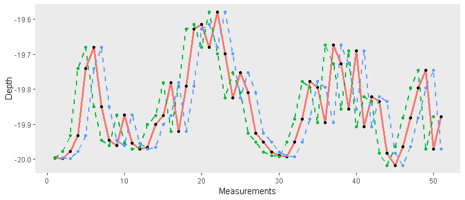
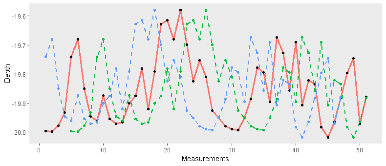
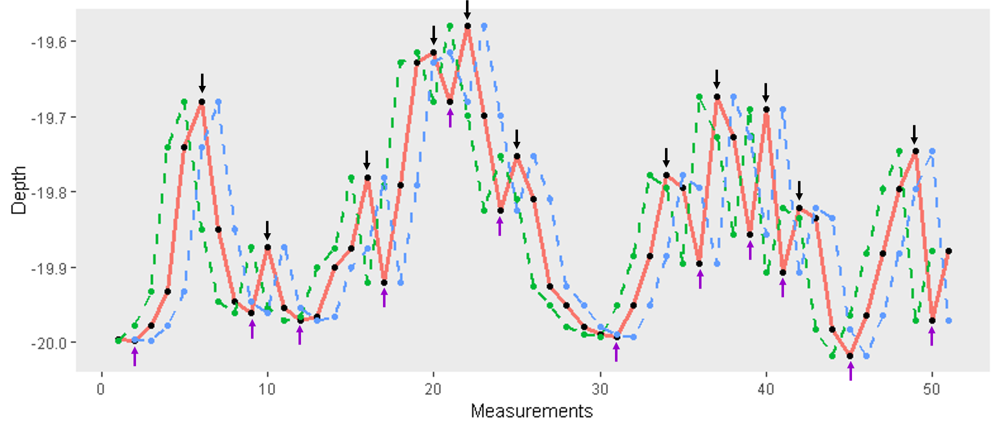
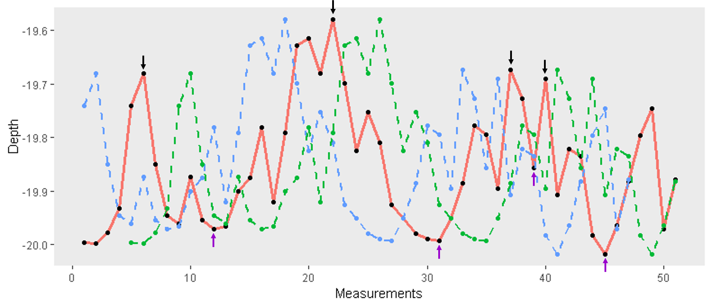

```{r setup, include=FALSE}
knitr::opts_chunk$set(echo = TRUE, message = F, warning = F)
```


This script includes functions needed to calculate the functional diversity of structural elements within a bottom profile.

Within community ecology, several indices have been proposed to capture species trait diversity (e.g., functional richness, functional evenness and functional dispersion).
These indices represent different aspects of the trait structure within the community. 

Here, we used the same methodology to represent structural element diversity, where each structural element is analogous to a species, and the attributes of that element (e.g., depth, size etc., see below) are analogous to species’ traits.

Two approaches were used to formulate the indices:

A. Quantify the diversity of structural elements within each transect: FunRichness, FunEvennes & FunDispersion (group A indices).

B. Quantify the diversity of structural elements within each transect, considering the entire elements pool: FunDistinct, FunIrregular & FunSingular (group B indices). 

Thus, the script is devided to 3 main sections:

1. Functions that calculate structural elements traits

2. Functions that calculate A indices

3. Functions that calculate B indices


The final function is **indices_calc_fun**, which applies all former functions and creates a data frame with indices values for each transect. 


##Data

The necessary data for these functions should include 3 variables:

  * Depth values along the bottom profile
  * Their order, i.e. an acending sequence of numbers corresponding to the measurements
  * An identification variable distinct for each bottom profile

The names of the columns should be: 'ID', 'depth', 'point'.
An example:
```{r, echo = FALSE}
#data = read_csv("simulation_data.csv")
#head(data)
```

Packages needed:
```{r}
library(dplyr)
library(tidyverse)
library(FD)
library(corrplot)
```


##Section 1: Functions that calculate structural elements traits, necessery for both indices groups (A & B) - 

1. **arrange_data_fun** - adds needed variables and change existing ones
 
2. **find_extrema_fun** - finds local extrema. This function is used within the next function:
 
3. **min_max_fun** - creates a dataframe of local extrema
 
4. **edit_min_max_fun** - tidy and manipulating local extrema information
 
5. **convex_elements_fun** - defines structural elements according to local extrema information
 
6. **primary_elements_plotting** - plots the division to elements within each transect
 
7. **add_maxima_prop_fun** - adds properties of local maxima, for later calculations
 
8. **height_data_fun** - calculate the height and depth parameters of structural elements
 
9-11. Functions that combine low, adjacent elements (<0.15 cm) together
 
12. **elements_traits_fun** - calculates elements' traits

13. **wrap_fun** - a wrapper function that combines functions 1-12 


Functions 1-13 are transect specific. "apply_wrap_fun" implements these functions on the full data, for each transect. 


14. **apply_wrap_fun** - applies the wrapper function. 

15. **filter_fun** - filters unsuitable transects. Since the standards are different for group A and group B indices, this function will be used later to create the suitable data for each group. 


**1. Add needed variables and change existing ones**:

'depth' variable is multiplied by -1 to create a realistic bottom profiles 

'unit' variable - measurements in ascending order, per transect

'points_per_transect' - number of sampling points, per transect

'distance' variable - the distance between two measurements, per transect

*transect length is needed as an argument

```{r}
arranged_data_fun = function (data, transect_length) {

  if( any(is.na(data$depth)) ) stop('missing depth data') #Calculation isn't possible with missing 'depth' values
  if( any(is.na(data$point)) ) stop('missing measurements data') #Calculation isn't possible with missing 'points' values

  data = as.data.frame(data %>% mutate(depth = depth * (-1),
                       unit = seq_along(depth), #If 'points' are continous along all transects, thus, a single transect does not start with '1' as a point, calculation will not work. Thus, a new variable - 'unit' - is defined. 
                       points_per_transect = length(depth), # Number of sampling points per transect
                       distance = transect_length / (points_per_transect-1))) %>%  #The distance between points within a transect
    select(ID, unit, depth, points_per_transect, distance)

  return(data)
}
```


**2. Find local extrema:** 

*This function is used within the 'min_max_fun' (see below). 

The *find_extrema_fun* finds local extrema within changing distances from each measurement.
It does so by creating a following and a leading sets of depths data sets. Than, it searches for measurements that meets these conditions:
1. Original measurements which are **higher (shallower)** than both new data sets, leading and following, are considered as local maxima. 
2. Original measurements which are **lower (deeper)** than both new data sets are considered as local minima. 

*This function was written by Evan Friedland
```{r}
find_extrema_fun  =  function (x, threshold = 1){
  #Create the *following* depth data set
  up    =  sapply(1:threshold, function(n) c(x[-(seq(n))], rep(NA, n))) 
  #Create the *leading* depth data set
  down  =   sapply(-1:-threshold, function(n) c(rep(NA, abs(n)), x[-seq(length(x), length(x) - abs(n) + 1)]))
  a     =  cbind(x, up, down)
  
  #Create a list of maxima amd minima: in which rows the value of original measurement is the  maximal/minimal among the three data sets, respectively
  list(minima = which(apply(a, 1, min) == a[,1]), maxima = which(apply(a, 1, max) == a[,1]))
}
```

To visualize it, see the following plot: 
The pink, thick line represents the original measurements, the dashed green line represents the following data set, and the dashed blue line represents the leading data set. 
In this case, the *threshold (n)*  was defined as 1. This means that the search range of local extrema is within a range of 1 measurement from each side of the of the original measurements. For example, in a data set of 50 measurements spreading over 25 meters, this would mean that the search range of local extrema is 0.5 m (25/50). 




Thus, we can define the prefered search range of local extrema using the threshold variable. If we set the threshold to 4, this means that the search range would be 2 meters (25/50 = 0.5 m between two consecutive measurement, thus 0.5m * 4 = 2m), as seen here: 




Within this search distance (the areas in the plots where the original measurements are the extremost data), the maximum and minimum depth values are searched and defined as local extrema:

**Black arrows - local maxima**

**Purple arrows - local minima**

**Threshold = 1**



**Threshold = 4**



Therefore, defining the threshold allows filtering of measurements 'less meaningfull' for complexity quantification (i.e convex/concave configurations which are a 'subset' of a larger configuration).

**3. Create a dataframe of local extrema, using the 'find_extrema_fun' function**
```{r}
min_max_fun = function (data, search_distance = 1) {
  # Define the search distance
  n = unique(ceiling(search_distance/data$distance))
  
  # Find extrema
  extrema <- lapply(1:n, function(x) find_extrema_fun(data$depth, threshold = x))
  
  # Find local minima
  bottoms <- lapply(extrema,function(x) x$minima)
  
  # Find local maxima
  tops <- lapply(extrema,function(x) x$maxima)  
  
  #Plot
  cf.1  =  grDevices::colorRampPalette(c('pink','red'))
  cf.2  =  grDevices::colorRampPalette(c('cyan','blue'))
  plot(data$depth, type = 'l', main = unique(data$ID))
  for(i in 1:n){
    points(bottoms[[i]], data$depth[bottoms[[i]]], pch = 16, col = cf.1(n)[i], cex = i/1.5)
  }
  for(i in 1:n){
    points(tops[[i]], data$depth[tops[[i]]], pch = 16, col = cf.2(n)[i], cex = i/1.5)
  }
  
  #Create data frame of minima and maxima of the two top ranks
  top_locals = rbind(data.frame(unit=tops[[n]], type = rep('max',length(tops[n])))
                     ,data.frame(unit=(bottoms[[n]]), type = rep('min',length(bottoms[n]))))
  middle_locals = rbind(data.frame(unit=(tops[[1]]), type = rep('middle_max',length(tops[1]))),
                        data.frame(unit=(bottoms[[1]]), type = rep('middle_min',length(bottoms[1]))))
  locals = rbind(top_locals,middle_locals)
  locals = locals[!duplicated(locals$unit),]
  
  data = left_join(data,locals)
  
  return(data)
}

```

**4. Tidy and manipulating local extrema information**

Since the edges of the depths data series often don't consist of local extrema defined using high thresholds (due to the procedure that *find_extrema_fun* operates), the extrema in the edges are left undefined. To some extant this is reasonable, since the topography beyond the transects' limits is unknown. 
However, cautios use of the extrema defined using lower thresholds can add information without the risk of inaccurate complexity quantification. Thus, the next function defined new extrema based on the data from the second lowest threshold defined. 

```{r}
edit_min_max_fun = function (data) {
  #Add ID per unit 
  data$id_unit = paste(data$ID, data$unit)
  
  #Remove data point which is not defined as minima or maxima
  no_na_type = data[!is.na(data$type),]
  
  #Manipulate the definition of the first minimum:
  #If the first or second extrema are 'middle_min', define them as 'min'
  first_type = first(no_na_type$type)
  second_type = nth(no_na_type$type, n = 2L)
  first_type_depth = first(no_na_type$depth)
  first_unit = first(no_na_type$unit)
  if(first_type == 'middle_min' | second_type == 'middle_min'){
    data$type[first_unit] = 'min'
  } 
  
  #Manipulate the definition of the last minimum:
  #If the last or before last extrema are 'middle_min', define them as 'min'
  last_type = last(no_na_type$type)
  before_last_type = nth(no_na_type$type, n = -2L)
  last_type_depth = last(no_na_type$depth)
  last_unit = last(no_na_type$unit)
  if(last_type == 'middle_min' | before_last_type == 'middle_min'){
    data$type[last_unit] = 'min'
  } 
  
  return(data)
}

```

**5. Define structural elements according to local extrema information**

```{r}
convex_elements_fun = function (data) {
  
  convex_elements_df = data.frame()
  i = 1
  element = i
  second_min = which(data$type == 'min')[(i+1)] #First, find the i+1 'max' in the bottom profile
  
  #As long as the 'second' (the following) 'max' isn't NA (it will only be NA once there are no more 'max's in the bottom profile) find the i ('first') 'max' (see the fourth line - loop stops if the second min = NA)
  while (!is.na(second_min)){ 
    first_min = which(data$type == 'min')[i]
    second_min = which(data$type == 'min')[(i+1)]
    if (is.na(second_min)){
      break
    }
    
    #Take rows from first_min until second_min
    convex_element_df = data[first_min:second_min,] 
    
    #If there is a 'max' type between the first and second min, define as element:
    if ('max' %in% convex_element_df$type){
      convex_element_df$element = element
      convex_elements_df = rbind(convex_elements_df, convex_element_df)
      element = element + 1 
    } 
    i = i + 1} #Recursive - go back and begin with the next 'i'
  
  return(convex_elements_df)
}
```

**6. Plot the division to elements within each transect, for visualization**
Colors represent elements
```{r}
primary_elements_plotting = function (data) {
  plot(data$depth, type = 'b', col = data$element, main = unique(data$ID))
}
```

**7. Add properties of local maxima (depth and location) per element, for later calculations**
```{r}
add_maxima_prop_fun = function (data) {
  
  inc_max_location = data %>%
    group_by(element) %>% 
    mutate(max_depth = max(depth[which(type == 'max')]), #If an element includes two maxima, extract the depth of the 'taller' (i.e shallower) one
           max_location = unit[which(type == 'max' & depth == max_depth)][1]) #If an element includes two maxima, extract the location (measurement number) of the 'taller' (i.e shallower) one
  
  return(inc_max_location)
}
```

**8. Calculate elements height and depths parameters**
```{r}
height_data_fun = function (data) {
  
  height_data = data %>% 
    group_by(element) %>% 
    mutate(first_min = depth[which(type == 'min')[1]], #Depth of the first minimum within the element
           second_min = depth[which(type == 'min')[2]], #Depth of the second minimum within the element
           mean_min_height = mean(c(first_min,second_min)), #Mean depth of the 2 minima
           
           #If there are 2 maxima in an element, take the higher (shallower) between the 2
           max_depth =  max(depth[which(type == 'max')]), 
           
           #If there are 2 maxima in an element, take the location of the higher (shallower) between the 2
           max_location =  unit[which(type == 'max' & depth == max_depth)][1], #Same as in max_height
           height = abs(max_depth-mean_min_height), #Elements height: the difference between the depth
           
           #of the maximum and the mean minima depth
           absolute_depth = max_depth,
           shallower_min = max(c(first_min,second_min)), #Different approach to define the minimum depth 
           
           #of an element: take the higher (shallower) minimum between the 2 
           height_2 = abs(max_depth-shallower_min)) #The elements' height according to the second minimum depth approach 
  
  return(height_data)
}
```

**9-11. Functions that combine low (<0.15 cm high) together**
Here, two functions combine low elements together and redefine the elements accordingly. The main function, "reducing_elements" is using an external function, "give_same_id". Finally, these functions are applied to the data by the "reduced_elements_fun".
```{r}
give_same_id = function (data) {
  
  data$new_id = NULL
  if (data[1,]$height > 0.15){
    data$new_id = data$element # If height of first row is higher than 0.15, the 'new_id' should be identical to the original one: 'element'
  } #The following condition is the one relevant to the second, external, function
  if (data[1,]$height <= 0.15){ #If height of the first row is lower than 0.15:
    data = data %>%
      dplyr::mutate(is_cont = (lag(data$x) == (data$x-1))) %>% # Check if x values are consecutive [TRUE/FALSE]. x is a new variable defined in the following function: "reducing elements", and represents the row number. 
      dplyr::mutate(new_id = ifelse(is_cont &!(row_number()==1), NA, element)) %>% # If x values are consecutive AND this is not row number 1, 'new_id' should be NA. If not, 'new_id' should be identical to the original one: 'element'
      fill(new_id,.direction = 'down') # Fill in the NA's in 'new_id'  with downward values
  }
  return(data$new_id)
}

#10
reducing_elements = function (trans_data) {
  trans_data %>%
    mutate(x=1:nrow(trans_data)) %>%   #Add variable - row number
    group_by(height<0.15) %>% #Group elements that are lower than 0.15
    nest() %>%
    mutate(new_id = map(data,give_same_id)) %>% # Apply 'give_same_id' function, where the second condition comes into place, since only low elements are taken to begin with.
    unnest() %>%
    arrange(x) %>% #Arrange by x, to maintain original order
    select(-new_id,everything(),new_id,-x,-`height < 0.15`) #remove, keep, and order variables
}


#11 - Apply the functions that combine the low elements and redefine the element numbers ("give_new_id" , which is hidden and included within the "reducing_elements" function):
reduced_elements_fun = function (data) {
  data = data %>% 
    dplyr::group_by(ID) %>%
    nest() %>%
    mutate(new_data = map(data,reducing_elements)) %>%
    select(ID,new_data) %>%
    unnest() %>%
    mutate(new_id_full = paste(ID,new_id)) #Combination of the new element id (new_id) and transect id (ID)
  
  data = data %>%
    group_by(new_id_full)%>%
    mutate(element_height = mean(unique(height)), mean_height_2 = mean(unique(height_2))) # 'new' height, after combining low elements
  
  return(data)
}
```

**12. Calculate elements' traits**
```{r}
elements_traits_fun = function (data) {
  
  data = data %>% 
    group_by(new_id_full) %>%
    mutate(x_dist = distance, #First, Rugosity 
           element_width = unique((n()-1)*(x_dist[-1])),
           depth_diff = abs(depth-lead(depth)), #Depth diffrences between subsequent measurements
           length_sum = sum(sqrt(((x_dist^2)+(depth_diff^2))),na.rm = T),
           rugosity = length_sum/element_width,
           
           #Vertical relief
           vr = abs(min(depth)-max(depth)),
           
           #Max slope between 2 measurements 
           x = 1:length(depth),
           y = depth,
           max_slope = max(na.omit(abs(diff(y)/diff(x)))),
           
           #Standard deviation
           sd = sd(depth),
           
           #Height to weight ratio 
           wh_ratio = height/element_width,
           wh_ratio2 = height_2/element_width) %>%
    
    select(-c(x_dist, depth_diff, length_sum, x, y)) #Remove unnecessary variables
  
  #Remove duplicated rows (all rows contains the same traits values for the element)
  data = data[!duplicated(data$new_id_full),]
  
  #Remove elements lower than 0.15 and narrower than 0.5 m
  data = data[!(data$height <= 0.15 & data$element_width <= 0.5 ),]
  
  return(data)
}
```


**13. Wrapper function**

The 'wrap_fun' function creates a data frame of elements' traits for each transect.

```{r, out.width= '50%'}
wrap_fun = function (data, transect_length, search_distance) {
  
  arranged_data = arranged_data_fun(data, transect_length)
  min_max = min_max_fun(arranged_data, search_distance)
  edited_min_max = edit_min_max_fun(min_max)
  elements_def = convex_elements_fun(edited_min_max)
  primary_elements_plotting(elements_def)
  included = add_maxima_prop_fun(elements_def)
  height_data = height_data_fun(included)
  reduced = reduced_elements_fun(height_data)
  elements = elements_traits_fun(reduced)
  
  return(elements)
}
```


**14. Apply wrapper function and filter unsuitable transects**
This function removes transects which are unsuitable for the analysis, and then rescales the values of traits among all transects (for comparability considerations). The output are two data frames consisting structural elements and their standerdized traits, one for each of the indices groups (A & B).
```{r}
apply_wrap_fun = function (data, transect_length, search_distance) {
  
  data_for_indices = data %>% 
    group_by(ID) %>% 
    #apply the wrapper function for each transect
    do(wrap_fun(., transect_length ,search_distance))
  
}
```

**15. Filter unsuitable transects** - filter unsuitable transects. 
Additionally, since the standards are different for group A and group B indices, this function will be used later to create the suitable data for each group. 

Criteria for nsuitable transects:
1. Transects compiled of elements with a total length less than 60% of the original transect length
2. Transects with less then 3 elements. Since condition applies to group A indices only.

```{r}
filter_fun = function (data, x) { #The x argument sets the threshold for number of elements per transect
  
  data = data %>%
    group_by(ID) %>%
    mutate(total_width = sum(element_width), elements_n = n()) %>%
    filter(total_width > 0.6*25 & elements_n > x) %>%
    ungroup() %>%
    #Scaling: for comparison among studies purposes, traits need to be standardized among all transects:
    mutate_at(funs(scale,as.numeric), .vars=vars('element_height', 'element_width', 'rugosity', 'depth', 'sd', 'vr', 'max_slope', 'wh_ratio')) %>%
    select(ID, element, new_id_full, element_height, element_width, rugosity, depth, sd, vr, max_slope, wh_ratio) 
  
  return(data)
}
```


## Section 2: Functions that calculate A indices.

* **fd_indices_fun** - calculates FunRichness, FunEvenness and FunDispersion using the *dbFD* function from the [FD](https://cran.r-project.org/web/packages/FD/FD.pdf) package.

* **originality_fun**  - calculates FunOriginality 

**fd_indices_fun** - calculates FunRichness, FunEvenness and FunDispersion. Traits are chosen. 

```{r}
fd_indices_fun = function (data, traits) {
  
  indices = data.frame()
  
  for(i in unique(data$ID)){
    sub = subset(data,ID == i)
    
    #Select the wanted traits, along with elements' ID
    sub = sub[,c('new_id_full', traits)]
    fd = FD::dbFD(sub, m = 3, stand.x = F) #Calculate structural diversity indices
    fd = select(data.frame(fd),c('FunRichness' = 'FRic','FunEvenness' = 'FEve','FunDispersion' = 'FDis')) #Select which structural diversity indices to use (see details in the FD package vignette)
    indices = rbind(indices,data.frame(ID = i, fd))
  }
  
  return(indices)
}
```

**originality_fun**  - calculates FunOriginality. Traits are chosen. 

```{r}
originality_fun = function (data, traits){
  
  originality = data.frame()
  for (i in unique(data$ID)) {
    sub = subset(data, ID == i)
    for_PCoA_sub = sub[, c(traits)]
    
    #Creating distance matrix between the elements of the transect
    for_PCoA_sub_dist = dist(for_PCoA_sub, method = 'euclidean', diag = FALSE, upper =
                               FALSE, p = 2) 
    
    #PCoA
    sub_PCoA = pcoa(for_PCoA_sub_dist, correction='none', rn=NULL)
    
    #elements locations in a multidimentional spaces
    PCoA_res = sub_PCoA$vectors 
    
    #Distance matrix of elements according to PCoA results
    row.names(PCoA_res) = 1:nrow(PCoA_res)
    dist_F = as.matrix(dist(PCoA_res, method = 'euclidean'))
    
    #Extract the minimum distance between an element and all its surrounding elements
    dist_F[which(dist_F == 0)] = NA 
    oriS = apply(dist_F, 1, min, na.rm = T ) 
    
    #Extract the maximum distance among all elements - this is the value which stands for FOri 
    FunOriginality = max(oriS)
    originality = rbind(originality, data.frame(ID = i, FunOriginality))
  }
  
  return(originality)
}
```


## Section 3: Functions that calculate B indices.

* **dist_matrix_fun** - creates a distance matrix between elements according to their traits

* **B_indices_prep_fun** - preperation for indices calculations

* **B_indices_fun** - calculates FunDistinct, FunIrregular and FunSingular


**dist_matrix_fun** creates a distance matrix between elements according to their traits. Traits are chosen. 

```{r}
dist_matrix_fun = function (data, traits){
  
  #calc. distances only among the wanted traits
  elements_dist= as.data.frame(as.matrix(stats::dist(data[, c(traits)], method = 'euclidean',diag = F, upper = T, p = 2)))
  
  return(elements_dist)
}
```

**B_indices_prep_fun** prepares data for indices calculations.
The second argument, 'gen_data', refers to the original elements traits data, to assign an ID for the created data. 

```{r}
B_indices_prep_fun = function (data, gen_data) {
  
  B_indices_data = data.frame()
  for(i in 1:nrow(data)){
    row = data.frame(dist = data[,i])
    
    #calc. total distances per focal element (row)
    total_dist = sum(row)
    
    #Preparation for FunIrregular calc.:
    #calc the relative contribution of each element to the total distances from a focal element 
    fi_per_element = row$dist/total_dist 
    #change '0' to NA for calc. comfort
    fi_per_element[fi_per_element == 0] = NA
    #since the function (see paper) is undifined for q = 1, it is 'rephrased', using the hill function. Finally, division by the number of elements (minus 1):
    FunIrregular = exp(-sum(fi_per_element*log(fi_per_element),na.rm = T)) / (nrow(row)-1)
    
    #Preparation for FunDistinct calc.:
    FunDistinct = total_dist/(nrow(row) - 1)
    
    results = data.frame(FunIrregular, FunDistinct)
    B_indices_data = rbind(results, B_indices_data)
  }
  
  ##Preparation for FunSingular calc.:
  B_indices_data$FunSing = B_indices_data$FunIrregular * B_indices_data$FunDistinct
  
  B_indices_data = cbind(ID = gen_data$ID, B_indices_data)
  
  return(B_indices_data)
}
```

**B_indices_fun** calculates FunDistinct, FunIrregular and FunSingular

```{r}
B_indices_fun = function(data, traits) {
  
  dist_matrix = dist_matrix_fun(data = filter_fun(data,1), traits) #Calc. the distance matrix
  indices_data = B_indices_prep_fun(data = dist_matrix, gen_data = filter_fun(data, 1)) #Prepare the data for indices calc.
  B_indices = indices_data %>%
    group_by(ID) %>%
    summarize(FunDistinct = sum(FunDistinct), #Calc. Functional distinctiveness
              FunIrregular = sum(FunIrregular), #Calc. Functional irregularity
              FunSingular = sum(FunSing)) #Calc. Functional singularity
  
  return(B_indices)
}
```


*calc_indices_fun* implements all former functions, and creates a data frame of all structural diversity indices. Additionally, it creates a correlation matrix among elements traits: if correlation between two traits is high (>0.7), their joint incorporation in the calculation of structural diversity indices should by carefully considered.
Please refer to Velliger et.al (2008) for more information.

```{r}
indices_calc_fun = function (data, transect_length, search_distance, traits) {  
  
  #Prepare elements' traits data
  data_for_indices = apply_wrap_fun(data, transect_length, search_distance)
  
  #Examine correlations among traits
  corrplot(as.matrix(cor(data_for_indices[,c('element_height', 'element_width', 'rugosity', 'depth', 'sd', 'vr', 'max_slope', 'wh_ratio')])), method = 'number', type = 'lower', tl.col = 'black', tl.srt = 45, number.cex = 0.6)
  
  #Calc. A indices group - FunRichness, FunEvennes, FunDispersion and FunOriginality: 
  indices = fd_indices_fun(filter_fun(data_for_indices, 3), traits)
  originality = originality_fun(filter_fun(data_for_indices, 3), traits)
  
  #Calc. B indicees group - FunDistinct, FunIrregular and FunSingular:
  B_indices_calc = B_indices_fun(filter_fun(data_for_indices, 1), traits)
  
  #Join both indices groups data
  final_indices_data = Reduce(function(x, y) merge(x, y, by ='ID', all=TRUE) , list(indices, originality, B_indices_calc))
  
  return(final_indices_data)
}

```

